# A Beginner's Guide to Plugin Deployment from Scratch

## 1. Setting Up the Python Environment

If you already have your preferred Python environment, just check if your Python version is greater than or equal to 3.9.

> [!WARNING]  
> It's not recommended to download the latest Python version, as some third-party libraries may not have adapted to the newest version yet, leading to plugin dependency issues.  
> In this guide, we will download the latest version of the previous major release.

> [!NOTE]  
> I personally dislike Conda installing its default environment on the system, so I won't explain how to use Conda here.  
> For an Anaconda virtual environment, refer to: [nailongremove Deployment Guide](https://y0b8o2qjszv.feishu.cn/docx/GJ7ndJU2Aod6jtxpukXcA6etnyb)

### 1.1. Windows

Visit the official Python website <https://www.python.org>, hover over "Downloads", and then click on "All Releases".

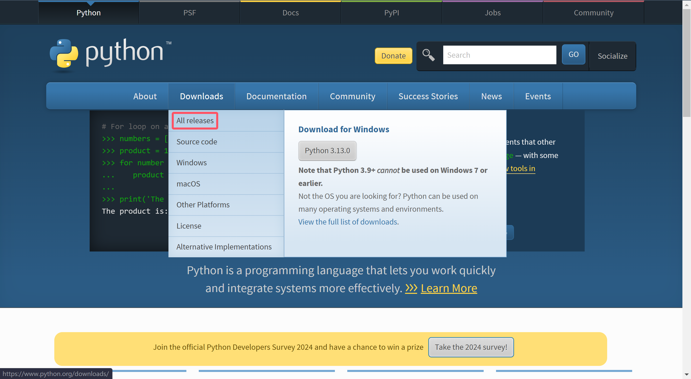

Scroll down to the "Looking for a specific release" section to find the version you want to download.

In the image above, you can see that the latest Python version is 3.13.0, so we'll look for the latest 3.12 version to download.


Click on the version, then scroll down to find the Windows installer (64-bit) for download. (Most computers today use X86 architecture with a 64-bit OS; if you have a different architecture, download the corresponding installer).

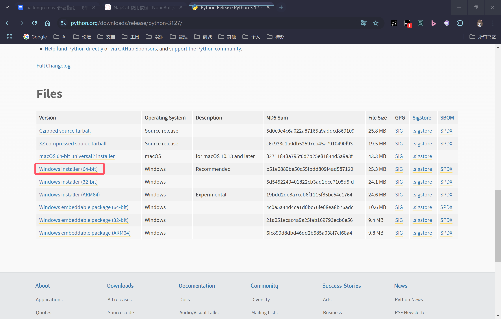

Once the download is complete, open the installer <sub><sup>(ignore that this is the installation interface for version 3.11)</sup></sub>, **make sure to check "Add python.exe to PATH"**! Then click "Install Now" to start the installation.

If you want to change the installation path, you can choose "Customize Installation" and modify the path, but make sure the installation path does not contain any Chinese characters.


Open a terminal (press Win + R, type `powershell`, and press Enter), and run the following command to verify if Python is installed successfully:

```shell
python -V
```


### 1.2. Linux

On Linux, we use [pyenv](https://github.com/pyenv/pyenv) to manage Python versions.

To install, run the following command in the terminal:

```shell
curl https://pyenv.run | bash
```

Then run the following commands to add the pyenv environment variable configurations to your shell configuration (if you're not using bash, replace the file name accordingly):

```shell
echo 'export PYENV_ROOT="$HOME/.pyenv"' >> ~/.bashrc
echo '[[ -d $PYENV_ROOT/bin ]] && export PATH="$PYENV_ROOT/bin:$PATH"' >> ~/.bashrc
echo 'eval "$(pyenv init -)"' >> ~/.bashrc
```

Reload the shell configuration:

```shell
source ~/.bashrc
```

Now you should be able to use pyenv:

```shell
pyenv -v
```


Follow the instructions in the [Wiki's Suggested build environment section](https://github.com/pyenv/pyenv/wiki#suggested-build-environment) to install the necessary dependencies based on your distribution. For example, for Ubuntu/Debian/Linux Mint:


Once the dependencies are installed, you can install Python 3.12 by running:

```shell
pyenv install 3.12
```

Wait for it to finish, then set Python 3.12 as the default version for your shell:

```shell
pyenv global 3.12
```

Finally, verify the installation:

```shell
python -V
```

<sub><sup> (Ignore the fact that the Python version here is 3.11) </sup></sub>  


## 2. Deploying NoneBot

Here, we use my developed [nb-cli-plugin-bootstrap](https://github.com/lgc-NB2Dev/nb-cli-plugin-bootstrap) to create a NoneBot2 project.

Choose a directory where you'd like to place your NoneBot2 project. It's best if the path does not contain Chinese characters.

Windows users can open the terminal by clicking on the address bar in the File Explorer and typing `powershell` (ignore that I typed `pwsh` in the image), as shown below:

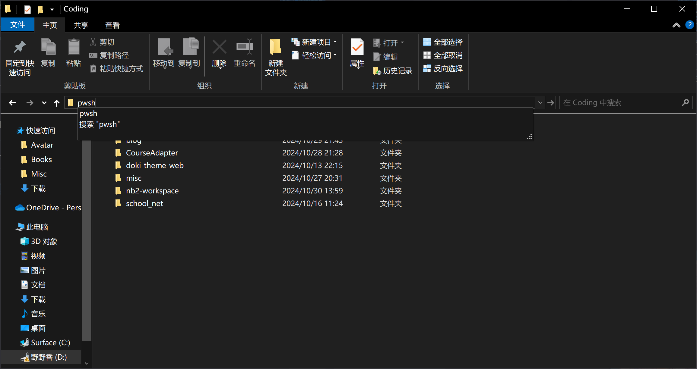

First, install `nb-cli` and `nb-cli-plugin-bootstrap` by running:

```shell
pip install nb-cli nb-cli-plugin-bootstrap
```

After installation, run the following command to create the project:

```shell
nb bs
```

The project name will be the folder name where the project is created.

When choosing the adapter, use the up and down keys to select the "OneBot V11" adapter (if you're connecting to a wild QQ bot), and then **press the space bar** to select that adapter.  
**Be sure to press space to select the adapter you want to install!** Once selected, the circle on the left will turn solid, and the item will light up—make sure to distinguish it!


Fill in the remaining options according to your preferences. If you don't want to customize, just keep pressing Enter to use the default settings.  
It's recommended to change the port number to avoid conflicts with already occupied ports that might prevent NoneBot from starting.

Some settings can be modified later via the `.env.prod` file, which can be opened with any text editor for detailed information.  
You will also need to fill in plugin configurations in this file.

After installation, it should look like this:

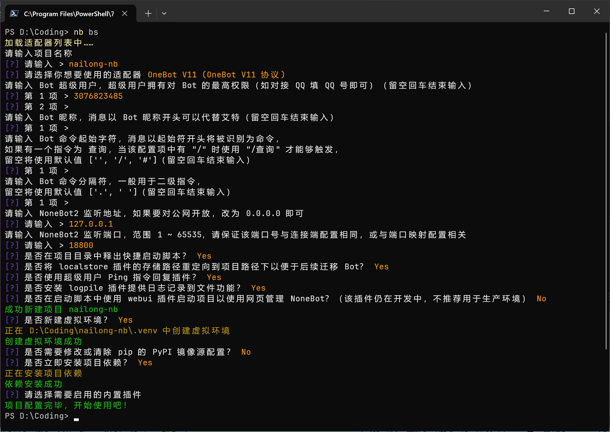

## 3. Installing the Plugin

Next, switch the working directory to your newly created project directory by running the following command in the terminal:  
<sub><sup>Alternatively, you can open the project folder in File Explorer, click the address bar, type `powershell`, and press Enter to open a new terminal window.</sup></sub>

```shell
cd 项目名
```

Now, install the plugin by running:

```shell
nb plugin install nonebot-plugin-nailongremove
```

> [!NOTE]  
> The plugin installed this way only supports CPU-based AI model inference.  
> Configuring for GPU operation can be quite complex and is only recommended for advanced users. Please check the README for more details.

The installation process looks like this:

  


## 4. Starting NoneBot

To start NoneBot, run the following command in the terminal:

```shell
nb run
```

On Windows, you can also double-click `#启动.bat`,  
On Linux, you can run `./#run.sh`.

~~**NoneBot, start!**~~

If everything goes smoothly without any errors, you should see the following:


## 5. Configuring Wild QQ Bot Protocol to Connect with NoneBot

If you're connecting to another chat platform (and installed other adapters in Step 2), skip this section and refer to the documentation for the corresponding platform adapter. Check the [Adapter Store](https://nonebot.dev/store/adapters).

Choose **one** of the following protocol implementations that you prefer to start using.

### 5.1. Lagrange.OneBot

A third-party NTQQ protocol implementation.

Go to the Actions page of the Lagrange repository, filter the Lagrange.OneBot Build workflow, then select the master branch ([Click here](https://github.com/LagrangeDev/Lagrange.Core/actions/workflows/Lagrange.OneBot-build.yml?query=branch%3Amaster)).

(This step is for manually opening the page. If you accessed it through the above link, you can skip this step.)  


Click the first checked item in the list on the right, then scroll down to find the "Artifacts" section, and download the build artifact for your machine's architecture.

If you cannot download the files from the list below, please log into your GitHub account.

<p>
<details>

<summary>How to identify your machine's architecture (from <a href="https://x.none.bot/before/install_lagrange">NoneBotX Community Docs</a>) (Click to expand)</summary>

- For general personal computers or Windows Server, try the `win-x64` version first;
- For personal computers/servers running a Linux distribution, try the `linux-x64` version first;
- For ARM devices like Raspberry Pi or smartphones, try `linux-arm64` first; if it doesn't work, try `linux-arm`;
- For Apple M-series chip compute

</details>
</p>

### 5.1. Lagrange.OneBot

For Windows, X86 architecture CPU, 64-bit systems (which are typically used by most home computers and Windows cloud servers), download the following:  
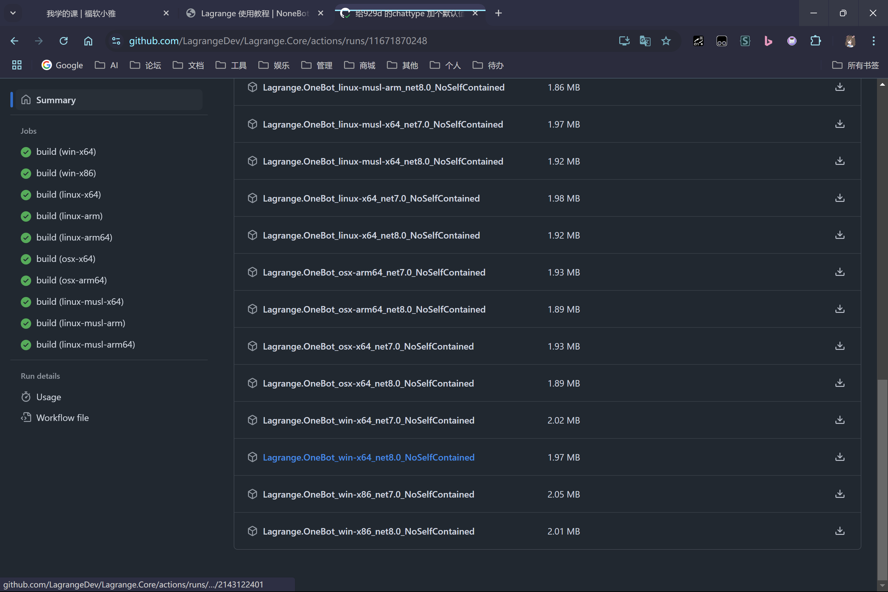

After the download is complete, open the compressed file, choose a directory where you'd like to extract the executable files, and then double-click to run it. Once you see the prompt like the one below, simply close it.

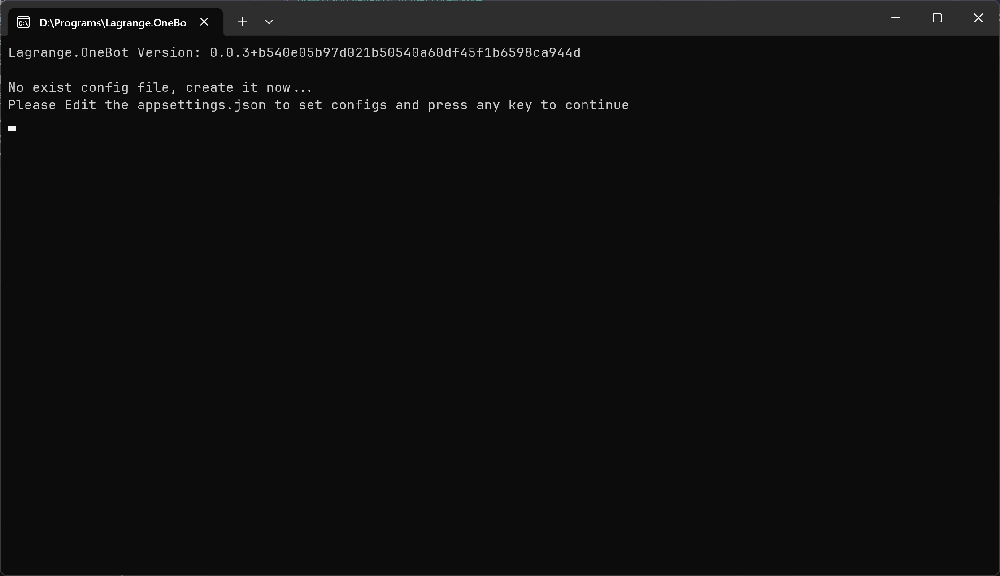

Open the `appsettings.json` file generated by Lagrange in the same directory.

Replace the `0` after `Uin` with your Bot's QQ number. Leave the password field blank and use the QR code login, as shown below.

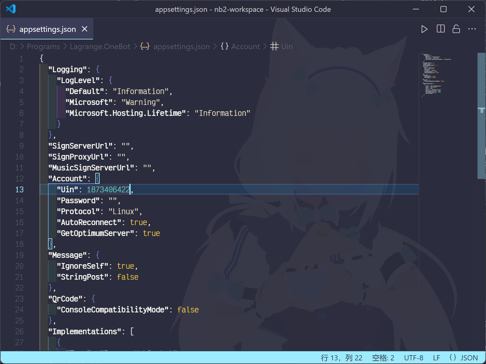

Next, modify the configuration to enable a reverse WebSocket connection to NoneBot. Refer to the image below and remember to change the `Port` value from `8080` to the port number you previously configured.

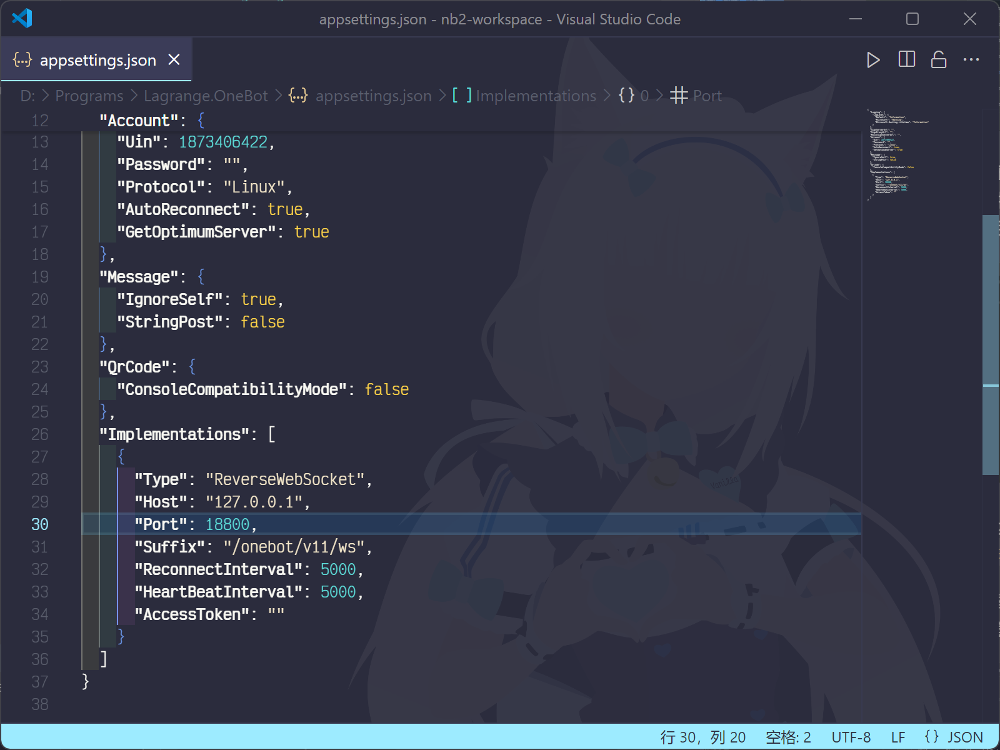

Then, run Lagrange again, log in to your Bot's QQ account using the mobile phone QR code.

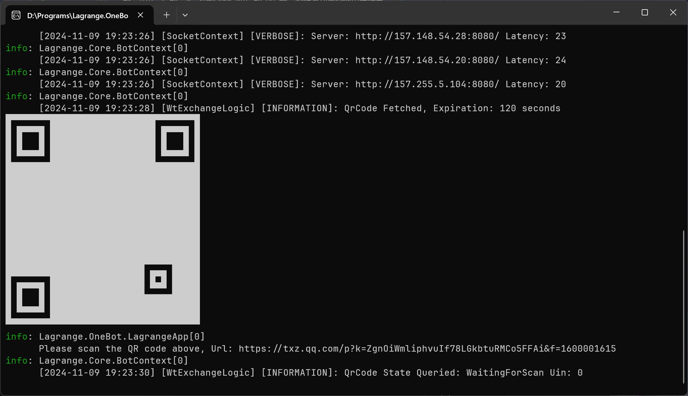

After that, you should see the message indicating that NoneBot is connected to your Bot and is able to receive messages.

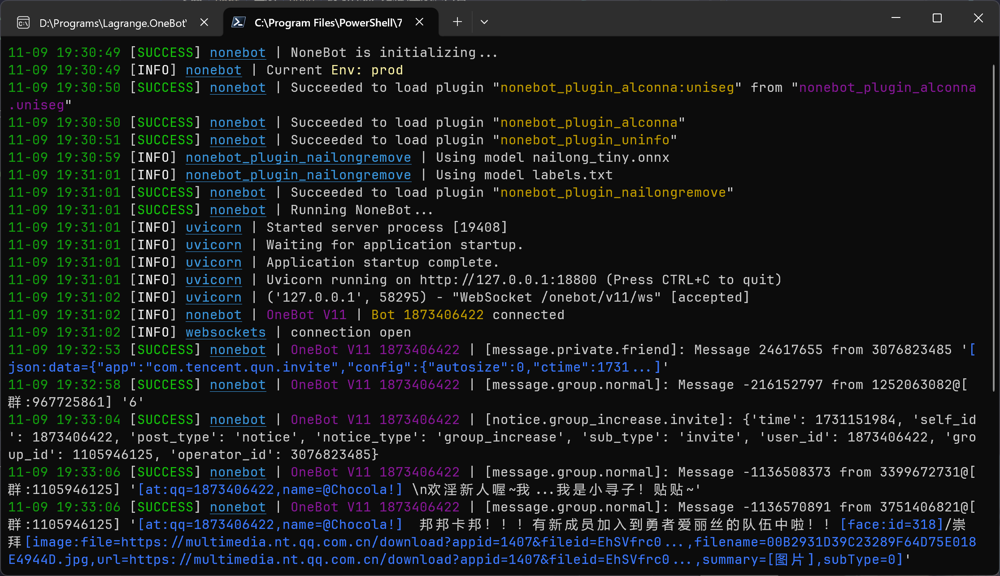

### 5.2. NapCat

NapCat is a protocol implementation based on QQNT, requiring the QQNT client to be installed. However, it can be run in headless mode (without a graphical user interface).

Follow the installation steps in the [NapCat Documentation](https://napcat.napneko.icu/guide/start-install).

Once installed, modify the configuration to enable reverse WebSocket connections to NoneBot. Choose **one of the following methods**:

#### Using WebUI to Modify Configuration

Find the WebUI address from the NapCat console, as shown in the box in the image below (both are the same, just different interface designs). Copy the address and open it in your browser.

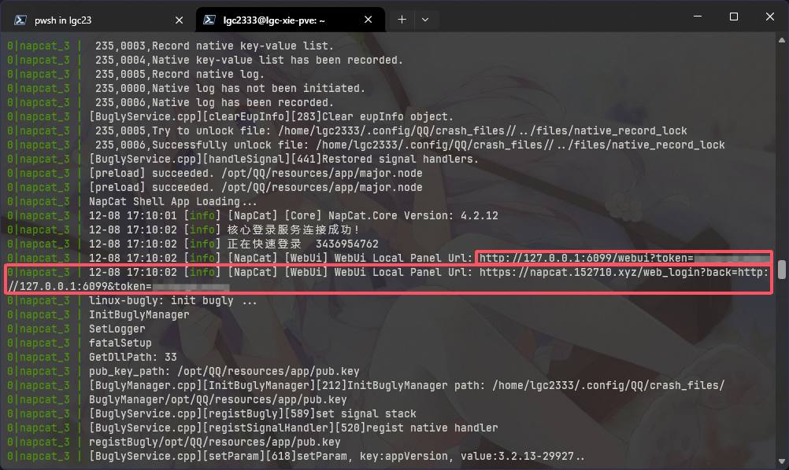

Then, follow the steps in the image below to add the network configuration.

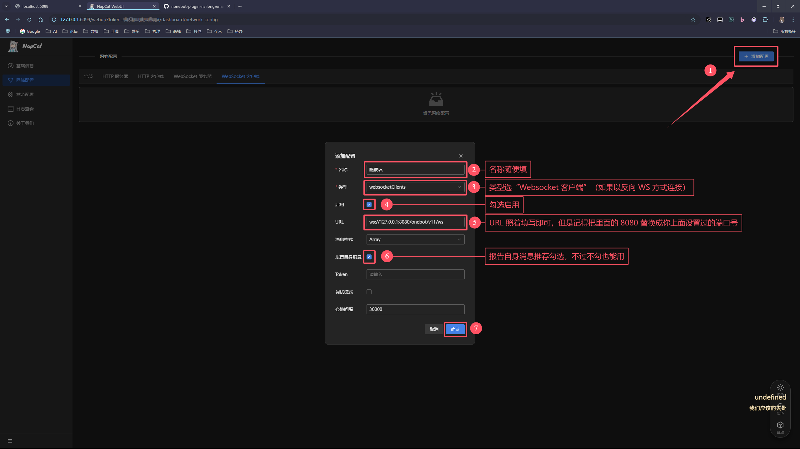

#### Manually Modify the Configuration File

Locate NapCat's configuration file and refer to the configuration example below. Remember to change the `8080` value to the port number you previously configured.

```jsonc
{
  // ...
  "wsReverse": {
    "enable": true,
    "urls": ["ws://127.0.0.1:8080/onebot/v11/ws"]
  }
  // ...
}
```

## 6. Follow-up

### 6.1. Restart

You don’t need to repeat the deployment steps. Just follow [Section 4](#4-启动-nonebot) to start your NoneBot, and then directly start the protocol endpoint you configured in [Section 5](#5-配置野生-qq-机器人协议端连接-nonebot).

### 6.2. Modify Plugin Configuration

Refer to the [NoneBot Documentation on DotEnv Configuration](https://nonebot.dev/docs/appendices/config#dotenv-%E9%85%8D%E7%BD%AE%E6%96%87%E4%BB%B6) for the file format, and modify the `.env.prod` file accordingly.

Example: If I want to modify the `NAILONG_MODEL` configuration to `1`, I would modify the `.env.prod` file like this:

```properties
NAILONG_MODEL=1
```

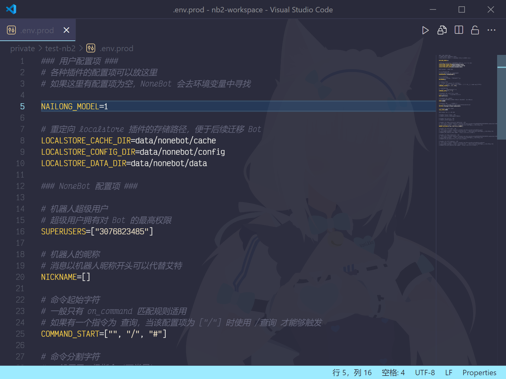

Example of multi-line configuration items:

```properties
NAILONG_MODEL1_SCORE='
{
  "nailong": 0.75,
  "htgt": 0.75
}
'
NAILONG_TIP='
{
  "nailong": "This group forbids sending 'nailong'!",
  "htgt": "Suspected 'nailong' corpse chunk"
}
'
```


### 6.3. Update the Plugin

Open the command line in the Bot project directory and execute the following command to update the plugin:

```shell
nb plugin update nonebot-plugin-nailongremove
```

### 6.4. Frequently Asked Questions

To be added.

For other issues not listed, please visit the [Issues](https://github.com/superbot-ai445/nonebot-plugin-nailongremove/issues?q=is%3Aissue) section to search for solutions.